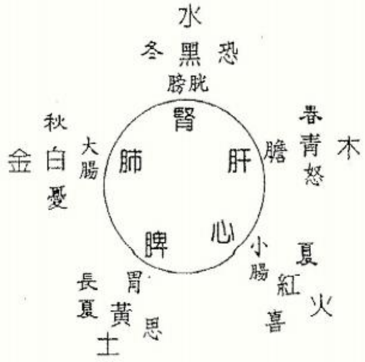

## 金匮眞言论篇第四

#### 黄帝问曰，天有八风，经有五风，何谓？

黄帝问道，吾闻天有八风，经有五风，是什么意思呢？

#### 歧伯对曰，八风发邪以为经，风触五藏，邪气发病。所谓得四时之盛者，春盛长夏，长夏胜冬，冬胜夏，夏胜秋，秋胜春。所谓四时之胜也。东风生于春，病在肝，俞在颈项。南风生于夏，病在心，俞在胸胁。西所生于秋，病在肺，俞在肩背。北风生于冬，病在肾，俞在腰股。中央为土，病在脾，俞在脊。故春气者，病在头。夏气者，病在藏。秋气者，病在肩背。冬气者，病在四支。故春善病鼽衄，仲夏善病胸胁，长夏善病洞泄寒中，秋善病风疟，冬善病痹厥。故冬不按蹻，春不鼽衄，春不病颈项，仲夏不病胸胁，长夏不病洞泄寒中，秋不病风疟，冬不病痹厥，飧泄而汗出也。

歧伯回答，天地有八方，风向依四季的变化而有不同，由东方吹来的风名“婴儿风”，柬南方吹来的风名“弱风”，南方吹来的风名“大弱风”，西南方吹来的风名“谋风”，西方吹来的风名“刚风”，西北方吹来的风名“折风”，北方吹来的风名“大刚风”，柬北方吹来的风名“凶风”。吾人随时都浸润此八风之中，当环境突变或起居不正常时或情志郁结不畅或饮食不节，身体内阴阳消长不平衡时，病邪就趁虚而入，渐渐进入五臓，这就是五风，造成病变。要深入了解，必须要从其生克制化之五行关系着手，有所谓四时之胜者，春盛长夏，长夏胜冬，冬胜夏，夏胜秋，秋胜春者。

图示如：

春天时吹东风，此时如伤于此风，病生在肝，因肝气值春季正旺，故必先受，其进入身体的管道在颈项。夏季吹南风，病人受病此时必伤及心，邪风进入位置在胸胁。秋季吹西风，病人受伤在肺，邪风进入位置在肩背风门肺俞穴位。冬季吹北风，病发在肾脏，邪风进入位置在腰部肾俞穴。以上为木、火、金、水，而四季在交换的间隔为中央属土，即为长夏，以黄历为准可知，春季自清明后的十三日至立夏为止共十八日；夏季自小暑后的十三日至立秋为止共十八日；秋季自寒露后的十三日至立冬为止共十八日；冬季自小寒后的十三日至次年立春为止共十八日，一年有四期为“长夏”，每期十八日，故长夏即季节在交替时的中间地带，此为易患脾病的时期，邪风进入位置在背脊十一、十二稚俞穴部位。又春季受病必先犯头。夏季受病及于内臓，因夏日炎热，脏气向外所致之故也；秋季受病其发在肩背位。冬季受病必中四肢关节。所以春季得病易生鼻衄。夏季得病胸胁苦满。长夏生病必里寒下痢。秋季生病必成风疟。冬季病必易生麻痹晕厥。归纳起来吾人可知，人在冬季收藏时节不过度运动，消耗体力，则春季来临时必不生鼻衄；春季时保护好颈项不使生病，则夏季来时不病胸胁，到了长夏季则不生洞泄里寒，到了秋季也不会得疟疾，冬天也不会延伸出麻木痹病，下痢而汗失禁不止了。

#### 夫精者，身之本也。敌藏于精者，春不病温。夏暑汗不出者，秋成风疟。此平人脉法也。故曰：阴中有阴，阳中有阳。平旦至日中，天之阳，阳中之阳也。日中至黄昏，天之阳，阳中之阴也。合夜至鸡鸣，天之阴，阴中之阴也。鸡鸣至平旦，天之阴，阴中之阳也。故人亦应之。夫言人之阴阳，则外为阳，内为阴。言人身之阴阳，则背为阳，腹为阴。言人身之藏府中阴阳，则藏者为阴，府者为阳。肝、心、脾、肺、肾五藏，皆为阴。胆、胃、大肠、小肠、膀胱、三焦六府，皆为阳。

所为“精”者，乃生命之泉源也。冬季知善于藏精气不外泄之人，春季则不生热病。夏季炎热时，吾人当汗出散热，今不汗出者，到了秋季必成疟病。这是一般人都会如此的。所以有“阴中有阴“阳中有阳”的说法。一天中自清晨日出到中午，此天阳最盛时，为阳中之盛阳。中午至黄昏时，天阳渐衰，乃阳中之阴者也。半夜子时至鸡鸣丑时，为天之至阴时，为阴中之阴也。从鸡鸣丑时至日出，天之阴已衰，乃阴中之阳也。此一日阳阴之消长，人亦如此合于自然之消长。光论人之阴阳，可说外表为阳，内里为阴。人身之阴阳，男则背为阳，腹为阴。女子相反，背为阴，腹为阳。如言人身脏腑之阴阳，则脏为阴，腑为阳。肝、心、脾、肺，肾主收藏转化之功，皆属阴。赡、胃、大肠、小肠、膀胱、三焦六府等，所有消化排泄系统，皆为阳。

#### 所以欲知阴中之阴，阳中之阳者何也？为冬病在阴，夏病在阳，春病在阴，秋病在阳，皆视其所在为施针石也。故背为阳，阳中之阳，心也。背为阳，阳中之阴，肺也。腹为阴，阴中之阴，肾也。腹为阴，阴中之阳，肝也。腹为阴，阴中之至阴，脾也。此皆阴阳表里，内外雌雄，相输应也。故以应天之阳也。

因此，欲知何谓阴中之阴？阳中之阳？可利用冬季病必在阴，夏季病在阳，春季病在阴，秋季病在阳。吾人可视节令及所在病变位而用针灸施治也。人之背为阳，其阳中之阳，乃心之属。其阳中之阴则为肺。腹为阴，其阴中之阴为肾也，阴中之阳则为肝，而阴中之至阴则属脾也，这些都是中医阴阳表里之概念，身体内舆自然互相呼应的现象。

#### 帝曰，五藏应四时，各有收受乎？

黄帝说，五脏既然对应四季，其间互相吸引、接受之关系又如何呢？

#### 歧伯曰，有东方青色，入通于肝，开窍于目，藏精于肝，其病发惊骇。其味酸，其类草木。其畜鸡，其谷麦。其应四时，上为岁星，是以春气在头也。其音角，其数八，是以知病之在筋也。其臭臊。南方赤色，入通于心，开窍于耳，藏精于心。故病在五藏，其味苦，其类火，其畜羊，其谷黍。其应四时，上为荧惑星，是以知病之在脉也。其音征，其数七，其臭焦。中央黄色，入通于脾，开窍于口，藏精于脾，故病在舌本。其味甘，其类土，其畜牛，其谷稷。其应四时，上为镇星，是以知病之在肉也。其音宫，其数五，其臭香。西方白色，入通于肺，开窍于鼻，藏精于肺，故病在背。其味辛，其类金，其畜马，其谷稻。其应四时，上为太白星，是以知病在皮毛也。其音商，其数九，其臭腥。北方黑色，入通于肾，开窍于二阴，藏精于肾，故病在溪。其味咸，其类水，其畜彘，其谷豆。其应四时，上为辰星，是以知病之在骨也。其音羽，其数六，其臭腐。故善为脉者，谨察五藏六府，一逆一从，阴阳表里，雌雄之纪，藏之心意，合心于精。非其人勿教，非其眞勿授，是谓得道。

歧伯回答道，例如东方主青色，入通人体内的肝，其通窍在眼，春季时人体之精藏在肝内，一旦受病易发惊骇。味觉上是酸味，如同草木是青色且酸一样，与鸡同性，食物中以小麦入肝，四时中为春季，天上受木星影响，所以春季气集中头部，五音中合于角音，即嘘声。洛数上为八，乃阴数之极意，其病必连到筋，气味腥臭。南方为赤色，入通人体内的心脏，通道在耳，夏季精气进入心脏，因此一旦受病，必及于五脏，因心为君主之官。味道苦的入通心脏，如同自然界中的火一样，性如羊肉之热，五榖中的黍也入通于心。对应于夏季，天上的火星对其有影响，有病时必先反应在脉上。其于五音中属于征音，就是呵音，洛数中为七，为纯阳之数，气味为焦味。中央为黄土色，与体内脾脏相应，通气之道在口，长夏时精藏于脾，脾气最旺，有病必见于舌，甘味之物入脾如同自然界中之土，五畜中如牛性，五榖中为稷，对应季在长夏，天上为土星在管，有病时肌肉必见反应。五音中为宫音，即呼声应脾，洛数中为五，居中位，气味为香味。西方为白色，入通体内肺脏，通气在鼻，秋季藏精气于此，有病发在背部，五味中辛辣味入之。其如同自然界中之金属类，五畜中如马性，五谷中为稻米，秋季应肺，天上金星在影响它，有病必先见于皮毛。五音中属商音，如呬声，洛数中为九，因而居人体之最上内脏也，气味亦腥臭。北方黑色，入通人体的肾脏，通口在尿口与肛门，冬季精藏于肾，故有病先见关节鼠蹊部，五味中咸味入肾，如同自然界中之水一样，五畜中为猪，五谷中属豆类，冬季应之，天上为水星，有病则先见骨病也。五音中为羽音，如吹声，洛数中为六数为少阴数，气味是腐败之味。所以善于诊察的医师，了解五脏六腑之关系，一顺一逆，阴阳表里之互动是否正常运作，男女的规律何为正常，了然于心，必能很精密的判断不致出错。圣人择人而教，绝不有教无类，不正确的知识勿传，以免误导学生，乃可谓得此道也！